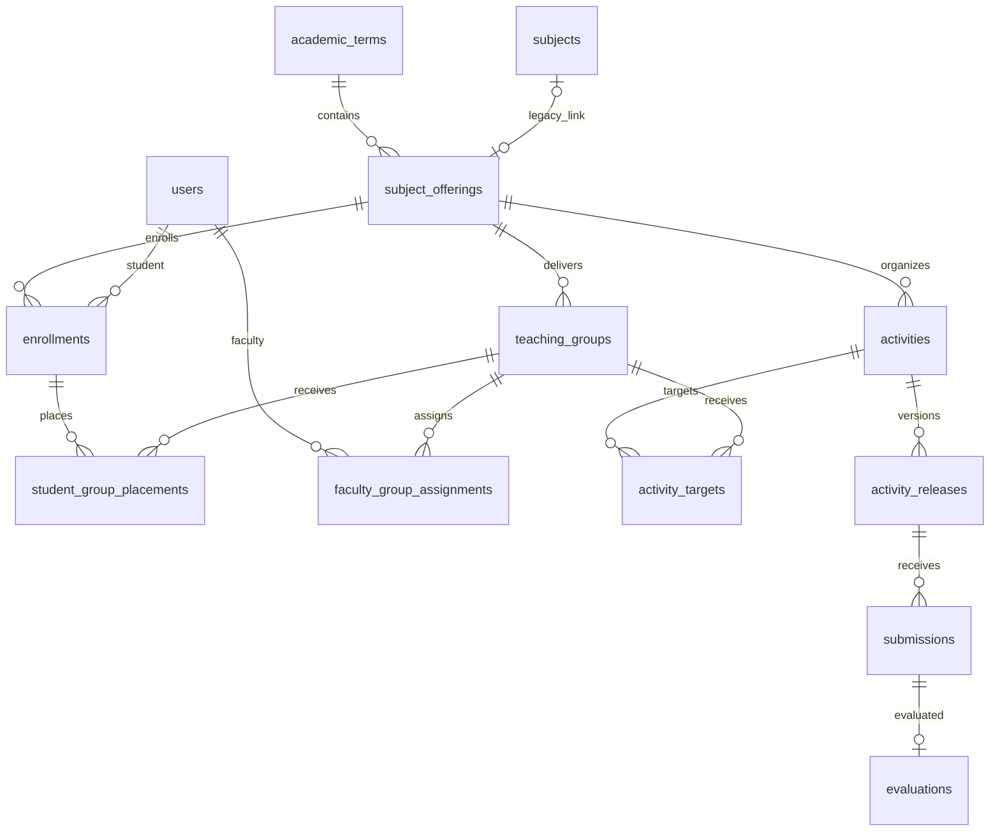

# ATOM local execution audit

Audit date: 2026-09-10, Asia/Taipei. Checkout: `master` at `e38627084617eed06e9198ebe3e2d5215eadbd41`.

## Verdict

ATOM is a working, narrow laboratory activity workspace. Keep its rich authoring, structured submission requirements, immutable releases, protected files, and transactional submission replacement. The current implementation is not ready for a multi-faculty class or authoritative grading.

The existing tests and build pass, and the existing HTTP smoke workflow passes on disposable data. Those checks miss important defects. This audit reproduced cross-faculty submission access, writes behind denied responses, a concurrent retry error, disappearing topic-associated activities, and a blank authoring page over HTTP LAN. A complete stopped-server restore passed when **all** persisted data was copied, including the teaching-assets directory omitted by the README.

The next bounded milestone is **Phase 0: a verified safety baseline**. This is the prerequisite to a safe real-course pilot, not a claim that the pilot is ready. The [roadmap](ATOM_ROADMAP.md) specifies exactly three next implementation tasks and a separate class-setup phase.

## Provenance and boundaries

- Read the supplied pasted ChatGPT findings first, then `ATOM_Codex_Deep_Audit_Prompt.md` and `ATOM_Repository_Audit_and_Roadmap.md` from Downloads. Both named Markdown files existed; fallback discovery was unnecessary.
- Treated the prior findings as investigation targets, and the document's feature list as requirements/roadmap context. No application implementation was inferred from that list. Work performed: audit documentation and disposable verification only.
- Local HEAD exactly matches the prior remote snapshot. Initial working tree was clean; history contains one visible commit. No reset, checkout, commit, push, issue creation, deployment, or application/dependency edits were performed.
- No applicable `AGENTS.md` was found in this repository or its ancestor directories. The root tracked inventory has 77 entries, including one gitlink. Nested `doc-automator` implementation was not audited or fetched.
- Node `v22.13.1`, npm `11.3.0`, Windows/PowerShell. This runtime actually loaded experimental `node:sqlite`; this does not validate every release described by “Node 22 or newer.”
- Inspected the full tracked inventory and reviewed the backend route/helper map, migrations, authentication, file and content validation, publication/submission/evaluation paths, frontend routing, recovery, and tests. Large frontend/editor files were sampled, not exhaustively line-audited. Explicit omissions are in [test evidence](ATOM_TEST_EVIDENCE.md).
- All runtime mutations used absolute roots under `C:\Users\neilj\AppData\Local\Temp\atom-audit-20260910-01a088b0`. The repository's real `data/` was not opened. Builds wrote only ignored generated output. Synthetic fixture credentials and session tokens are not included in this report.
- Severity describes the intended shared-class use, not evidence of an attacked or compromised deployment. This is a broad engineering audit, not an exhaustive penetration test or certification.

## Architecture and workflow map

The runtime is a modular-monolith candidate: React/TypeScript/Vite serves through Express, with synchronous SQLite persistence and asynchronous filesystem operations. `server/src/index.ts:70` separates the application and storage roots; `server/src/db.ts:24` enables foreign keys, WAL and FULL synchronous mode. `package.json:9` builds frontend and server; production startup serves `dist` from the application root. There is no need established here for a framework or database rewrite.

Source references below are checkout-relative, with one-based line numbers.

| Workflow | UI entry and API | Authority, validation, persistence/files | Verification / limits |
|---|---|---|---|
| Initial setup and sign-in | `src/App.tsx:112`, `features/auth/AuthPages.tsx`; `/api/setup`, `/api/auth/login` | `server/src/auth.ts:94`, `:154`; loopback setup claims existing faculty, scrypt credentials, server-side sessions | Auth tests and smoke pass; setup cannot create a genuinely new course |
| Password/session/account lifecycle | App session load, change-password, logout/switch; `src/api.ts:30` | `auth.ts:52` expiry, `:122` logout, `:134` password change, `:219` student reset; credential and audit tables | Forced student change/logout in smoke; expired session HTTP 401 and browser reload to login; outstanding-save/account-switch races untested |
| Local recovery / preview | Auth recovery page; `index.ts:179`, `:184`, `:189` | `auth.ts:199`, `:204`, `:291`; loopback recovery revokes sessions; preview conditional on environment | Direct LAN list 403; synthetic same-host proxy list 200; no deployed proxy inspected |
| Academic structure | SubjectHome -> SubjectWorkspace; bootstrap `index.ts:200` | `db.ts:251`; terms, offerings, groups, assignments, enrollment, placements; `index.ts:1155`, `:1251` | Seeded structure works; no create/edit course, group, faculty or enrollment administration API chain |
| Topic create/rename/delete/order | AssessmentStream topic manager -> `index.ts:233`, `:253`, `:265`, `:310`, `:338` | Same-offering/period checks; delete clears topic assignments transactionally and checks affected activity edit permissions | Period movement defect reproduced; ordering utility tests pass; full rendered reorder/delete not exercised |
| Activity organization | Detail/stream -> `index.ts:290`; draft PATCH `:460` | Organization endpoint checks offering/period; full PATCH does not reconcile topic | Both period directions reproduced; no general activity deletion/archive API found |
| Rich authoring / synchronization | `ActivityAuthoring.tsx:25`; create/PATCH `index.ts:404`, `:460` | Revision conflict, content and blueprint validators, per-user/activity recovery key; IndexedDB | Smoke conflict and publication warning pass; localhost create/title save/reload passes; storage failure handling not proven |
| Teaching assets / collaboration | Editor -> `index.ts:736`, `:780`, `:802`, `:832`, `:857` | MIME signature checks, size limits, ID-scoped files; edit/publish collaborator flags; immutable-release asset deletion guard | PNG and text material restored/downloaded; upload before auth reproduced; read/duplicate authority broader than edit authority |
| Publish/unpublish/republish | Editor/detail -> `index.ts:528`, `:628` | Snapshot JSON, monotonically versioned releases, scope and asset rows; creator/collaborator permission | Smoke and restore republish pass; response scope can reject after mutation; old release links persist |
| Student delivery | ActivityDetailPage -> detail/list API | `index.ts:1277`, `:1287`, `:1414`; published release membership, opening time, snapshots | Smoke visibility, one appearance for overlapping placements, part claim and rejection pass |
| Upload/current/history/download | ActivityDetailPage upload -> `index.ts:868`, `:993` | Role/release/deadline/extension/size checks, blueprint validation, hash, move then DB transaction; one-current and idempotency indexes | Smoke and download pass; same-key concurrent 201/500 with one row/current; abort/crash/revision-limit races not tested |
| Faculty evaluation / student evidence | EvaluationDialog -> `index.ts:1019`; serialization `:1585` | Finite nonnegative numbers, one upserted evaluation per submission; no grading delegation or criterion score/revision tables | Unauthorized writes and unsupported totals reproduced; result data returned to student's own history, no explicit grade-release lifecycle |
| Quizzes/exams/export | SubjectWorkspace ModuleEmpty; bootstrap `index.ts:204` | Quiz/exam availability explicitly false; no exam/TOS/OMR/scoring/gradebook engine found | Placeholders, not broken completed engines; no document-generation integration proved |

### Strengths to preserve, with qualifications

1. Immutable activity release IDs, snapshots, group scopes and asset references exist. Submission records reference the release actually received against. Preserve those IDs during migration.
2. The unique current-submission index and transaction kept one current submission during the reproduced retry race. Fix error semantics without weakening this guarantee.
3. Strict structured validation returns a report and leaves the previous accepted submission current. Validation never runs submitted code. ZIP checks inspect directory metadata; this is not malware scanning or complete archive-content verification. Descriptive mode skips inspection; warning mode is non-blocking.
4. Content validation limits nodes, links, nesting and document size (`activity-content.ts:54`, `:157`). Renderer escapes text and uses KaTeX `trust: false` (`RichDocumentRenderer.tsx:92`). These are useful defenses, not proof that all rich-content payloads have been fuzzed.
5. Hashed/revocable sessions, forced initial student password changes, exact-origin checks and explicit disabled modules are meaningful existing work. Student-number initial passwords still do not establish student identity.

## Findings

### A01 — Cross-faculty submission disclosure and grading

**High; authorization defect; reproduced.** Earlier F01 confirmed.

Evidence: `server/src/index.ts:1251`, `:1524`, `:1547`, `:1570`, `:993`, `:1019`. Combined eligible-student queries do not receive the viewer identity. Direct download and grading require only offering membership.

With A assigned only Lab 2A and B only Lab 2Ax, A's combined shared-activity detail returned both students and both submissions; own-group detail returned one, while an explicit B-group request correctly returned 403. A could still download B's submission (200) and evaluate it without a group parameter (200). Both students retain their common lecture placements; neither tested faculty was assigned to that lecture. No collaborator grant was needed. The existing schema has only edit/publish collaboration, not explicit grading delegation or a coordinator role.

Impact: shared offering membership bypasses intended student grading boundaries. **Correction:** one viewer-aware policy for submission list/count/detail/file/evaluate, based on authorized instructional scope and the relevant release. Authoring collaboration must not implicitly grant grading. **Acceptance:** disjoint lab instructors, shared lecture variants, direct IDs, all/concrete scopes, inactive/transferred students, and explicit delegation if introduced; denial never changes any row. **Dependency:** agree the minimal grading authority rule before adding coordinator privileges; default proposal is no implicit cross-group access.

### A02 — Denied responses occur after mutations

**High; mutation integrity/authorization; reproduced.** Earlier F01 is broader than evaluation alone.

Evidence: evaluation write `index.ts:1040` precedes group check `:1065`; unpublish update `:633` precedes `responseScope`; publish commits before detail serialization (`:528–626`). A grade request naming B's forbidden group returned **403 but persisted score 8**. Unpublish with `teachingGroupId=unknown-group` returned **403 but persisted draft status**. A copied foreign-group draft could be published: response **404**, persisted status **published** (see A03).

Impact: a caller cannot trust rejection to mean no action occurred. **Correction:** validate target, permission and requested response scope before work, and independently validate publication target authority. A response serializer is not an authorization boundary. **Acceptance:** snapshot relevant activity/release/evaluation/audit tables before each denied request and prove unchanged afterward. **Dependency:** A01/A03 shared policy; test each mutation route, including organization, not only evaluation.

### A03 — Duplication bypasses activity visibility and carries foreign targets

**High; authorization defect; reproduced.** Additional finding.

Evidence: `index.ts:641–734` uses offering access, copies content/assets and all source targets, makes caller creator, and constructs a concrete response scope without checking caller group access. `:528–551` checks creator/publish capability but only that target groups belong to the offering.

A could not open B's separate draft (404) or publish B's original (403), but could duplicate it (201). Publishing that copy later returned 404 while persisting publication to B's group. This establishes both access to otherwise hidden content and target-scope mutation, regardless of whether general faculty material sharing is eventually desired.

**Correction:** explicitly authorize reading/copying source material; restrict or deliberately reselect destination groups; check actor target authority before publication. **Acceptance:** hidden source cannot be copied; copied activities cannot retain unauthorized targets; intended shared-material use requires an explicit documented permission. **Dependency:** A02 and an authoring-versus-delivery policy. Do not remove valid coauthor behavior indiscriminately.

### A04 — Backup guidance omits teaching files

**High; operational data-loss risk; mismatch confirmed, full restore reproduced.** Earlier F02 confirmed.

Evidence: README local data/backup section; `index.ts:77–82`; `db.ts:443–468`. Normal teaching assets use `data/activity-assets`. Stress starter assets instead use `data/uploads/activity-assets` (`seed-authoring-stress.ts:64`). Backing up only SQLite plus uploads misses ordinary teaching materials.

A full stopped-server data copy restored five stored-file hashes, two teaching downloads (PNG and TXT), a submission download, faculty login, and an evaluation; integrity check was `ok`, foreign-key check returned zero violations. A partial README-only restore was not executed; missing-directory consequence is established by paths, not mislabeled as a runtime drill.

**Correction:** adopt the complete-data procedure in test evidence and document root semantics/WAL/access controls. **Acceptance:** repeat restore from the documented procedure into a new directory and compare DB relationships plus file/download hashes. **Dependency:** none; this drill used synthetic data, not an institutional backup or ACL validation.

### A05 — Multipart processing precedes authorization

**Medium; availability hardening defect; reproduced.** Earlier F04 confirmed.

Evidence: Multer `index.ts:85–101`, `:736`, `:868`; role checks are inside handlers. Two small unauthenticated partial requests (one asset, one submission) produced a visible temporary file before the request ended; final status was 401. Limits are 50 MiB/one file, with additional 10 MiB image and per-activity checks after reception. No aggregate quota/concurrency policy was found.

**Correction:** authenticate and check URL-known access before receiving multipart data; retain post-reception checks and cleanup. **Acceptance:** bounded unauthorized/aborted/oversized tests, no retained temp file or incorrect current row, and controlled concurrency. **Dependency:** A01 for submission access. No load attack or capacity estimate was attempted.

### A06 — Same-host proxy can defeat local-maintenance boundary

**High if proxied without exclusions; conditional deployment risk with mechanism reproduced.** Earlier F03 confirmed with narrower deployment claims.

Evidence: `auth.ts:199–216`, `:291`; recovery routes `index.ts:179–187`. Direct request to the host's non-loopback IPv4 address returned 403. A disposable loopback-forwarding HTTP proxy returned 200 for unauthenticated faculty listing. Reset uses the same guard; proxy reset was not executed and no live deployment was inspected.

**Correction:** exclude setup/recovery from LAN proxy forwarding or move maintenance to a separate local mechanism; keep backend reachability consistent with that design. Do not authorize through arbitrary forwarding headers. `ATOM_HTTPS=true` only controls metadata/cookie behavior; `index.ts:1091` still uses HTTP `createServer`. **Acceptance:** actual intended proxy rejects external recovery/setup while deliberate local recovery audits and revokes sessions. **Dependency:** choose supported deployment boundary before adding TLS proxy guidance.

### A07 — Evaluation lacks release-specific scoring policy and revisions

**High before authoritative grading; academic integrity gap; reproduced/static.** Earlier F05 confirmed.

Evidence: `index.ts:1019–1072`, `:2071`; `db.ts:152`; `activity-blueprint.ts:176`; EvaluationDialog total/deduction inputs. Negative score and string `Infinity` returned 400. A score of 1000 with deduction 2000 returned 200 against the smoke rubric (10 criterion points, expected 11 acknowledged at publication). Subsequent updates left one evaluation row. There is no explicit extra-credit policy, criterion evaluation table or revision history in the inspected schema.

Impact: the application cannot explain the academic basis of a total or recover overwritten grading decisions. This does not establish that every over-maximum grade is intrinsically invalid. **Correction:** approved scoring/exception policy bound to submission release/rubric; criterion scores and immutable revisions; explicit grade-release and contribution states. **Acceptance:** reproduce totals from criterion evidence, reject policy violations, preserve previous values/actor/reason, distinguish missing/ungraded/excused/zero. **Dependencies:** A01/A02 first; full workflow is Phase 3, with policy guardrails before authoritative use.

### A08 — Moving grading period hides topic-associated activities

**Medium; functional integrity defect; reproduced in both directions.** Earlier F06 confirmed.

Evidence: activity PATCH `index.ts:494–517`, topic validation `:1711`, stream construction `:1319–1372`. A Midterm activity moved to Final Term retained its Midterm topic, remained in the list endpoint, but was absent from every stream section. Final Term to Midterm behaved identically. Create and organization endpoints do validate topic scope, narrowing the defective write path.

**Correction:** atomically reject incompatible movement, clear the topic, or require a valid destination topic; apply the invariant to full PATCH, duplicate, organization and migration paths. **Acceptance:** both movements remain discoverable with a same-offering/same-period topic or no topic, with regression tests against the stream API. **Dependency:** no schema rewrite needed.

### A09 — Simultaneous retry returns an internal error

**Medium; reliability defect; reproduced once with two concurrent requests.** Additional finding to earlier upload investigation.

Evidence: duplicate precheck `index.ts:894`, awaited validation/hash/move, unique insert `:958`, generic error `:1086`; unique constraint `db.ts:145`. Two concurrent roughly 512 KB submissions with the same idempotency key returned **201 and 500**. Database retained one key row and one current submission.

**Correction:** resolve duplicate-key races to the committed result (and define payload mismatch behavior), allocate revision/limit decisions under the appropriate transaction, recheck mutable release/deadline state at commit. **Acceptance:** bounded same/different-key concurrency, one current row, deterministic retries, no surplus committed file or exceeded revision budget. **Dependency:** A05 lifecycle; successful sequential retry alone is insufficient. Revision/deadline/state races beyond the tested same-key case remain unverified.

### A10 — HTTP LAN authoring crashes on UUID creation

**High for the advertised LAN workflow; browser defect; reproduced.** Earlier F09's browser concern is now concrete.

Evidence: `ActivityAuthoring.tsx:408–418` directly calls `crypto.randomUUID`; other callers at `:192`, `:353`, `:364` and routed student file selection `ActivityDetailPage.tsx:103`. Browser login and stream worked at the host's non-loopback HTTP origin. Clicking New activity produced a blank page and console `TypeError: crypto.randomUUID is not a function`. Localhost creation worked, and title autosave persisted after reload (revision 2).

**Correction:** explicitly support the selected LAN transport with a capability-tested identifier implementation, or deliver a fully tested secure-origin deployment; do not just set a cookie environment variable. Audit every UUID caller. **Acceptance:** real supported origin, faculty create/add-part/add-section and student file selection/upload; no blank screen. **Dependency:** A06 if HTTPS is the chosen approach. Student UUID failure is a source-supported exposure, not a separately reproduced upload interaction.

### A11 — Recovery UI overstates durability when storage fails

**Medium; static risk, not reproduced.** Evidence: `ActivityAuthoring.tsx:78–96`, `:113–159`, `:245`; `recoveryStore.ts:12–57`; `src/App.tsx:73`. `writeRecovery` is fire-and-forget without a rejection handler in the effect, reads silently fall back to null, and generic save failures set the “device” state. The sign-out prompt then asserts a device copy exists. No verified-write acknowledgement backs that assertion on every path.

**Correction:** represent memory-only/locally persisted/server persisted/error separately and handle IndexedDB open/transaction abort/quota errors. Serialize saves or otherwise prove in-flight revision handling and scope/account cancellation. **Acceptance:** denied storage plus failed network never claims a saved copy; reload/recovery tests prove which copy survives. **Dependency:** targeted browser fault injection; no data-loss scenario was simulated in this audit.

### A12 — Stress seed ignores the configured storage root

**Medium; tooling/data-boundary defect; static.** Evidence: `seed-authoring-stress.ts:10` calls `openAtomDatabase(process.cwd())`, while server `index.ts:71` and `seed-demo-accounts.ts:5` honor `ATOM_ROOT`. Running the stress npm script from the repository with an alternate root can therefore write the repository's data instead of the intended fixture root.

**Correction:** share explicit root resolution and add a guard appropriate to development seeding. **Acceptance:** launch from disposable cwd A with disposable `ATOM_ROOT=B`; only B changes, and required fixture source paths still resolve. **Dependency:** verify this before using the stress command during audits. It was deliberately not executed here.

### Product and handoff gaps (not regressions)

- **G01, high pilot blocker:** setup claims seeded identity; no normal real-course/faculty/group/enrollment configuration chain. `legacySubjectForOffering()` (`index.ts:1666`) still requires a legacy subject record. Phase 1 must replace demo dependence without invalidating historic IDs.
- **G02, required future domain:** no structured syllabus versions, CLOs, hours, explicit lecture/lab links or assessment requirement fulfillment. Topics currently organize activities. Phase 2/3 adds these, not editor redesign.
- **G03, required future assessment:** no question-bank/TOS/exam forms/responses/scoring/item-analysis/OMR engines; no rubric criterion scoring/gradebook/substitution lifecycle. Placeholders are correctly marked unavailable. Phases 3–5 are new work.
- **G04, recommended broader evidence support:** direct submissions are only `.py`/`.zip`. Extend controlled files/text/links according to actual teaching needs, without executing code.
- **G05, reproducibility:** `doc-automator` is gitlink mode 160000, pinned to `55229cfc0242779275d38319408b5909719d8fc7`; no tracked `.gitmodules` or CI configuration. It is populated locally but not referenced by the app build/start scripts. Integration is unproven. Track/untrack it intentionally; do not assume it supplies exam generation.
- **G06, low UI accuracy:** `src/components/AppHeader.tsx:48` hardcodes `192.168.10.150`; browser displayed it even when served at another address. Replace with truthful connection information during LAN work. This is not a verified connectivity indicator.

## Actual academic model and extension constraints

This is a selected current relation diagram, not an exhaustive schema. `subjects` is a legacy term/section-bearing record, **not yet a clean reusable course catalog**. Nullable legacy link is unique. Offerings are unique by term/code; groups by offering/component/label; enrollments by offering/student. Placement and faculty assignment pairs are unique. Placement foreign keys do not themselves enforce that enrollment and group belong to the same offering; add service validation plus an enforceable persistence invariant when introducing setup writes. Current enrollment has active/inactive status, not temporal placement history or multiple same-offering attempts. There is no explicit lecture-to-lab relation, archiving workflow or supported transfer lifecycle.

Minimum proposed extensions (all future work):

| Relationship | Proposed cardinality and invariant | Migration / historical rule |
|---|---|---|
| Course definition -> offerings | One course, many offerings; code/title reusable, term on offering | Backfill distinct catalog entries with reviewed identity matching; retain legacy bridge until all writers migrate |
| Course -> syllabus versions -> offering selection | Many immutable approved versions; offering selects one version | Existing offerings may explicitly have no syllabus until configured; never fabricate hours/CLOs |
| Lecture <-> lab link | Optional links within offering; a lecture can link to any number of labs | Decide whether lab has one parent or multiple associations; no automatic inference from labels |
| Enrollment -> dated placements | Multiple component placements, validated same offering and active interval | Preserve old release/submission population; do not reinterpret historic grades through today's placement |
| Syllabus topic <-> CLO and assessment coverage | Many-to-many; planned hours by component; organizational topic remains separate | Preserve `activities.topic_id`; add coverage rather than repurposing it |
| Requirement -> assessment fulfillment | Zero/many topic plans; one selected fulfillment per scope/student exception for a major slot | Explicit approval and effective policy; exam and project cannot both contribute to the same slot |
| Draft -> release -> administration/assignment -> attempt/evidence | Separate versions, target populations and delivery modes | Reuse activity immutable-release idea, retain existing IDs/files; snapshot rule and rubric references |
| Rubric version -> evaluation revision -> criterion scores | Per-submission/release rubric, append-only revisions, actor/reason | Legacy totals labeled legacy manual evidence, never invented criterion breakdowns |
| Grade contribution -> gradebook | Requirement/category weight and versioned policy; explicit result release | Distinguish ungraded, missing, excused and zero; no grading weights inferred from current scores |

Restrict hard deletion of referenced academic entities; use archival state and retained identifiers. Proposed uniqueness constraints must be scoped (offering, requirement, student/administration) rather than global assumptions. Introducing real-course setup requires dry-run/backfill validation of legacy links and cross-offering placement consistency before migrations are applied to owner data.

Decisions still needed: course identity across departments, lab-parent cardinality, grading delegation/coordinator scope, lecture/lab aggregation, category weights, late/retake/extra-credit rules, result release, and who approves project substitution. The audit does not invent those institutional policies. Keep synchronous SQLite until measured workload/locking evidence justifies a change; two-request retry correctness is a transaction design issue, not proof of a storage-engine capacity limit.
