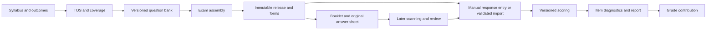

# ATOM bounded development roadmap

2026-09-10 · Based on the local audit of `e38627084617eed06e9198ebe3e2d5215eadbd41`.

## Next milestone and stop condition

**Phase 0: verified safety baseline for the existing activity workflow.** Stop and review when the three tasks below meet their acceptance criteria. This milestone makes the existing synthetic workflow trustworthy enough to proceed into real-course setup; it does not declare a multi-faculty deployment ready or make ATOM the authoritative gradebook.

The first usable product pilot then completes Phase 1: one genuinely new course/offering, distinct instructors, linked groups and enrolled students, without SQL edits or renamed demo records. Keep grades provisional/manual until the Phase 3 evaluation policy and history gates pass. Syllabus planning, exam generation and scanning remain separate acceptance milestones.

## Exactly three next implementation tasks

1. **Enforce faculty, submission and publication authority before mutation.** Extract a small tested policy boundary from `server/src/index.ts` for viewer-scoped submission queries/files/evaluation, source activity copying, target groups, and response-scope validation. Cover A01–A03 with two distinct lab instructors, shared lecture variants, shared/separate activities, direct IDs, combined/concrete scope and collaborators. A denied request must leave relevant data unchanged. Explicit authoring collaboration remains separate from grading; add delegation only with a defined policy. Completion proof: automated regression cases fail on the audited code and pass after the fix, with retained one-current/release invariants.
2. **Repair the existing browser and submission lifecycle on the supported LAN origin.** Address A05/A08–A12: authenticate before upload reception; make concurrent same-key retries deterministic; keep topic/period consistent; remove unchecked UUID assumptions; report actual recovery durability; honor storage-root isolation in tooling. Include bounded concurrency and storage-failure fixtures, localhost plus actual intended LAN-origin faculty/student interactions, mobile editor check and account/scope lifecycle checks. Use narrow commits/subtasks, preserving current editor/release contracts. Completion proof: no unauthorized temp receipt, one current submission without retry 500, both period moves discoverable, no LAN blank page, no “saved on device” assertion after failed storage.
3. **Deliver and rehearse the deployment/recovery runbook.** Correct backup inventory and actual root semantics, define loopback maintenance/proxy exclusions, clearly separate demo and class startup, and document supported transport. Rehearse complete stopped-server restore of a synthetic course with released materials, submission/evaluation history and hashes. Include immutable grading caveats (A07) and explicitly prohibit treating totals as authoritative until policy/revision work lands. Completion proof: actual supported proxy boundary if used, new-root restore with file/API checks, unchanged owner data, and PROJECT_STATE updated with exact verification. Do not declare TLS enabled solely through `ATOM_HTTPS`.

## Phases

| Phase | Usable outcome and scope | Exclusions | Migration risks | Acceptance / stopping point |
|---|---|---|---|---|
| 0 — Safety baseline | Existing activity workflow survives instructor-boundary, upload, browser and restore checks | New course model, quizzes/exams, grading policy invention | Preserve existing IDs/releases; new policy must not accidentally block explicit valid coauthors | The three tasks above pass; no implication of authoritative grades |
| 1 — Real-course pilot | Create real course/offering, faculty identities/assignments, groups and optional lecture/lab links; enroll/place students with validated activation | Full SIS, scheduling optimization, syllabus importer, gradebook | Legacy subject bridge; duplicate course matching; cross-offering placements; historical transfers | Configure a new course, 2 different instructors and separate labs without SQL/demo renaming; each sees only authorized students; stopped restore works |
| 2 — Syllabus-aware planning | Versioned syllabus, CLOs, component hours, topic coverage and optional assessment requirements; planned/authored/published status | Automatic document parsing, blanket required assessment types, automatic equivalence claims | Unknown historical syllabus must stay unknown; pin offering to version; keep organization separate from coverage | Faculty can find a planned but missing quiz/lab, prepared unpublished activity and uncovered CLO; multi-topic assessment supported |
| 3 — Complete evaluation | Criterion scores, released rubric reference, immutable grade revisions, explicit result release, controlled evidence types, requirement fulfillment and basic gradebook | General-purpose code judge, proctoring, advanced analytics | Legacy totals cannot be retroactively decomposed into criteria; released policy/rubric must remain stable | One activity/project assigned -> submitted -> evaluated -> released -> contribution; correction traceable; project/exam slot cannot double-count |
| 4 — Written-exam MVP | TOS -> versioned questions -> assembly/forms -> printable booklet/own sheet -> manual/imported responses -> scoring -> analysis -> contribution | Camera recognition, universal psychometric validity, third-party answer-sheet compatibility | Canonical item identity differs from printed position; freeze questions/key/form/layout/scoring policy | One full exam completed without scanner; deterministic known-response fixtures, print inspection, audited key correction/re-score |
| 5 — Scan/review | Original-sheet image intake, registration/form matching, OMR, review, duplicates, corrections and rescoring | Autonomous acceptance of uncertain marks, paid scan dependency, unverified offline/browser/device guarantees | Image evidence retention, wrong-form rejection, source-neutral responses, prior scoring revisions | Real printed-and-scanned fixtures on target devices/transport; ambiguity review; mismatch/repeat/correction proofs |

The phase order follows dependencies found in the audit. Moving scanning earlier would introduce recognition uncertainty before item-response identity and scoring exist. Moving all planning and grading into the first safety milestone would prevent a useful bounded stop.

## Ranked initial backlog (nine items)

| Rank | Work item | Finding / dependency | Exit evidence |
|---:|---|---|---|
| 1 | Shared faculty/submission authority and pre-mutation checks | A01/A02 | Negative access tests and unchanged DB on denial |
| 2 | Duplicate/source/target publication policy | A03, #1 | Hidden source denied; copied target reselected/authorized before write |
| 3 | Supported LAN browser IDs and truthful recovery | A10/A11, #1 | Real-origin create/upload; storage denial gives honest state |
| 4 | Upload auth, same-key race and commit-time invariants | A05/A09, #1 | Bounded concurrent success/retry, one current, cleanup |
| 5 | Topic period integrity | A08 | Both directions appear in stream |
| 6 | Complete backup/maintenance/tool-root boundary | A04/A06/A12 | Restore hash drill; proxy boundary; alternate-root test |
| 7 | Real-course setup and identity-safe enrollment | G01, #1–6 | New course without SQL or demo reset |
| 8 | Versioned syllabus/CLO plans and coverage | G02, #7 | Planned/authored/published evidence states |
| 9 | Evaluation policy, revisions and requirement fulfillment | A07/G03, #7 | Reproducible criteria/contribution and no double-counting |

Exam and scan work follows these phases; it is intentionally not another initial backlog item competing with permission fixes.

## Incremental architecture

Keep React/TypeScript/Express/SQLite and one deployed frontend/API origin for now. Introduce small domain boundaries as changes require them: authorization; academic setup; publication; submission receipt; evaluation; future exams; reporting. Characterize existing behavior before moving code. Avoid a large routing refactor as a prerequisite to fixing the failing routes.

Use service transactions for authority plus writes, while separating expensive file reads from the critical section and revalidating mutable facts before commit. File movement and SQLite transactions are not one atomic resource; define recoverable pending/received state or reconciliation for crash windows. Protect root resolution consistently across server and maintenance scripts. Measure event-loop blocking, upload concurrency and SQLite write latency using realistic bounded fixtures before making capacity claims or changing engines.

Preserve immutable release IDs and file hashes. Define upgrades and rollback compatibility; take a complete backup and rehearse migration against a copy. Do not silently backfill unknown academic policies or reinterpret existing totals. Record legacy evaluation evidence as such.

### Minimal domain additions

Add a reusable course catalog separate from offering; reviewed catalog backfill and optional syllabus selection. Add versioned syllabus topics/CLOs and component hours, with delivered progress separate from approved plan. Optional same-offering lecture/lab relationships permit standalone lecture/lab groups and more than two labs. Model inactive enrollment and dated placement changes without erasing historical populations. Enforce uniqueness and same-offering invariants at service and persistence boundaries.

Keep assessment **kind**, **delivery**, and **grading role** distinct. An activity can organize under one stream topic while covering multiple topics/CLOs. A planned requirement exists before its authored artifact and may have no fulfillment yet. A major requirement has one selected exam/project fulfillment for the relevant class or approved student exception; uniqueness prevents two active contributions to that slot. Keep assignment/administration, submission/attempt, evaluation and gradebook contribution separate.

## Future assessment specification (proposed, not implemented)

### Syllabus and planning

Support structured manual entry plus an attached official syllabus first. Version approval and offering selection preserve previous semesters. Store hours by component, topic/CLO coverage, resources and optional assessment requirements. Show planned, authored, published and evaluated from actual relationships/events; no fabricated completion percentage. Missing evidence is an explicit state. One topic need not contain every assessment kind.

### Activities, projects and grade contribution

Reuse content, parts, manifests, protected assets, recovery and release snapshots. Expand direct submission types through explicit allowlists and validation, then text/links if the pilot needs them. Group projects are optional future scope, not mandatory first release.

Score rubric criteria against the rubric attached to the student's release, with appropriate performance descriptors and documented maximum/extra-credit/deduction policy. Preserve actor, previous/new values, timestamp and change reason as append-only revisions. Proposed final score is policy-defined from raw score and authorized deductions; do not invent whether negative final scores are clamped. Store raw score, maximum, deduction and final result distinctly. Missing/ungraded/excused/zero and result-release status are different states.

A requirement slot defines its grading role/weight; an approved exam or project fulfills it. Normalize only under the approved policy. Different raw maxima do not imply interchangeable rigor. Preserve outcome/rubric justification and the authorized exception; ensure exam plus replacement does not both count.

### Written-exam pipeline

TOS specifies coverage by topic/CLO/cognitive category with a configurable total. Allocation rounding must preserve the exact total; a proposed deterministic largest-remainder allocation needs stable tie ordering and recorded approved overrides. Do not hardcode question count, choices, cognitive ratios or weights.

Give a canonical question an identity and immutable content versions. Exam placement points to a version and carries displayed number/order/choice permutation. Reusable stimuli/assets are independent from placements. Freeze TOS, questions, key, form map, print layout and scoring policy per release. Separate an administration's eligible students/attempts from the reusable exam. Preserve blank/multiple/missing/invalid responses rather than collapsing them to a score during ingestion. Version corrected keys and rescoring runs, with previous results recoverable and grade changes attributable.

### Original print layout and scanning boundary

Define an original versioned layout with alignment markers, documented geometry, scale, permitted item/choice counts and opaque form/layout/attempt identifiers. QR payloads should carry references, not unnecessary student personal data. Booklet and sheet must resolve to the same immutable form and key. Document print scaling and page-size checks; test output at actual printer settings.

Manual entry and strict import first establish canonical responses. Scanning later supplies candidate marks plus image provenance, recognition confidence and review state. Require layout/form detection, registration, ambiguous/erased/multiple-mark review, duplicate detection, mismatched-form rejection and audited corrections. Rejected/uncertain recognition is not an authoritative grade. Test actual printed-and-scanned sheets on intended phones/scanners and network transport; no performance or recognition-accuracy promise is justified by generated bubbles.

### Scoring and item-analysis contract

Proposed first model: dichotomous keyed items with deterministic scoring and explicit eligibility. Keep formulas and denominator policy versioned with the report. These are architecture proposals, not a validated implementation.

- Difficulty: `p_i = correct_i / eligible_i`. Expose the denominator; return unavailable when it is zero.
- Discrimination: propose corrected item-rest Pearson correlation `corr(X_i, total - X_i)` for dichotomous items. Both vectors require nonzero variance; otherwise provide an unavailable reason.
- Distractors: counts/proportions by option, with explicit blank/multiple/missing states and denominators.
- Reliability: candidate KR-20 for equally weighted dichotomous items, `k/(k-1) * (1 - sum(p_i*(1-p_i))/Var(total))`. Specify a consistent variance convention, complete response matrix, `k>1`, positive total variance and population assumptions. Preserve negative results. Independently calculated fixtures must verify the final convention.

These candidate measures follow [University of Washington scoring guidance](https://www.washington.edu/assessment/scanning-scoring/scoring/reports/item-analysis/) (checked 2026-09-10). Its classification thresholds are not adopted as ATOM policy. No numerical engine was implemented or validated here.

Acceptance fixtures must cover: all correct/all wrong, mixed answers, blanks, multiple marks, missing imports, rekey/excluded items, one item, one student, tied totals, zero variance, very small groups, alternate forms and retakes. Descriptive counts may still be valid when correlation/reliability is unavailable. No blanket `n < 30` algorithm switch. Kruskal–Wallis must not be used as an automatic substitute for item discrimination. Test small-sample reporting independently and label uncertainty.

Scoring reports concern students' marks; item diagnostics concern administered items; cohort comparisons require comparable versions/keys/forms, aligned populations/retake rules, and authorized access. Do not pool different examinations or current and historic item versions simply because topic names match. An external criterion and substantive review are needed before claiming validity or equivalent rigor.

## Decisions before their dependent phase

| Decision | Needed before | Proposed temporary stance, not institutional policy |
|---|---|---|
| Who may grade other instructors' students? | Phase 0 policy | Deny absent explicit authority; authoring collaboration alone is insufficient |
| HTTP LAN support versus secure-origin deployment | Phase 0 browser/deployment work | Preserve advertised workflow only if capability tests pass; HTTPS setup must actually terminate TLS |
| Can a lab link to multiple lecture groups? | Phase 1 schema | Do not infer from labels; permit optional links pending cardinality decision |
| New account activation / student identity proof | Phase 1 setup | Faculty-mediated or one-time verified activation; predictable student number alone is insufficient |
| Lecture/lab grade aggregation, weights, late/retake/extra credit | Before authoritative evaluation/contribution | Leave unconfigured/provisional; never infer from example totals |
| Who approves project replacement and exceptions? | Phase 3 fulfillment | One explicitly approved active fulfillment per requirement scope |
| Supported item types, scoring and cohort-analysis policies | Phase 4 | Start narrow with documented dichotomous fixtures; no scanner dependency |
| Hardware, print settings, image retention and ambiguity thresholds | Phase 5 | Establish with actual device tests, not assumptions |

## Do not build yet

No dashboard redesign, editor expansion for its own sake, framework/database rewrite, microservices, student-information ERP, remote proctoring, general student-code execution, automatic syllabus extraction or scanner-first project. The local `doc-automator` gitlink and unseen DATS work do not establish reusable production components. A later authorized reuse comparison must check ownership/licensing, contracts, versions, test fixtures and maintenance costs before importing anything.

After each accepted milestone, update PROJECT_STATE with actual results, unresolved findings, decisions and exactly three next tasks. Do not turn “implemented” into “verified” by editing a status label.
